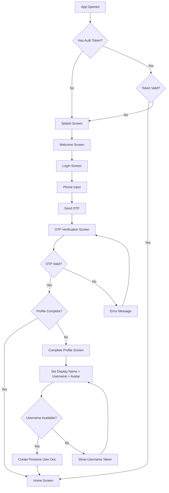
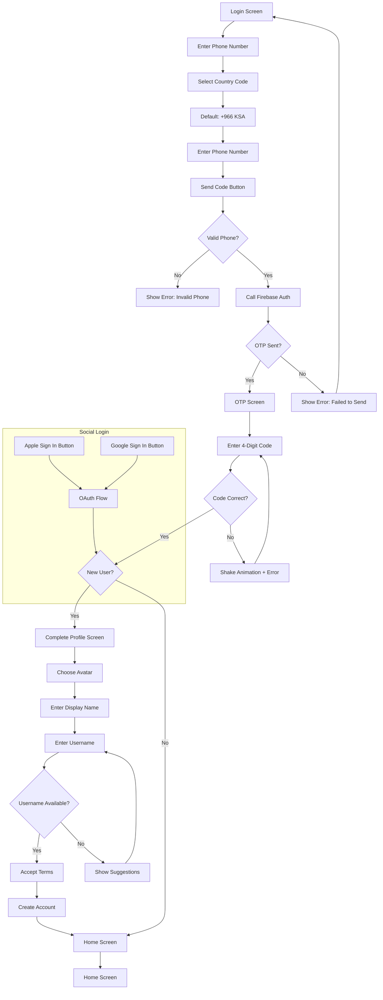
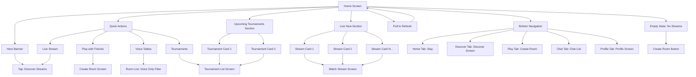
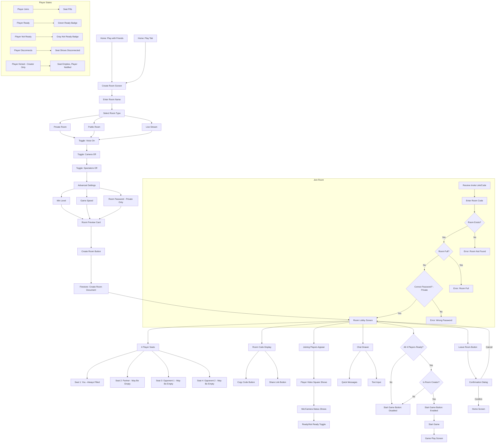
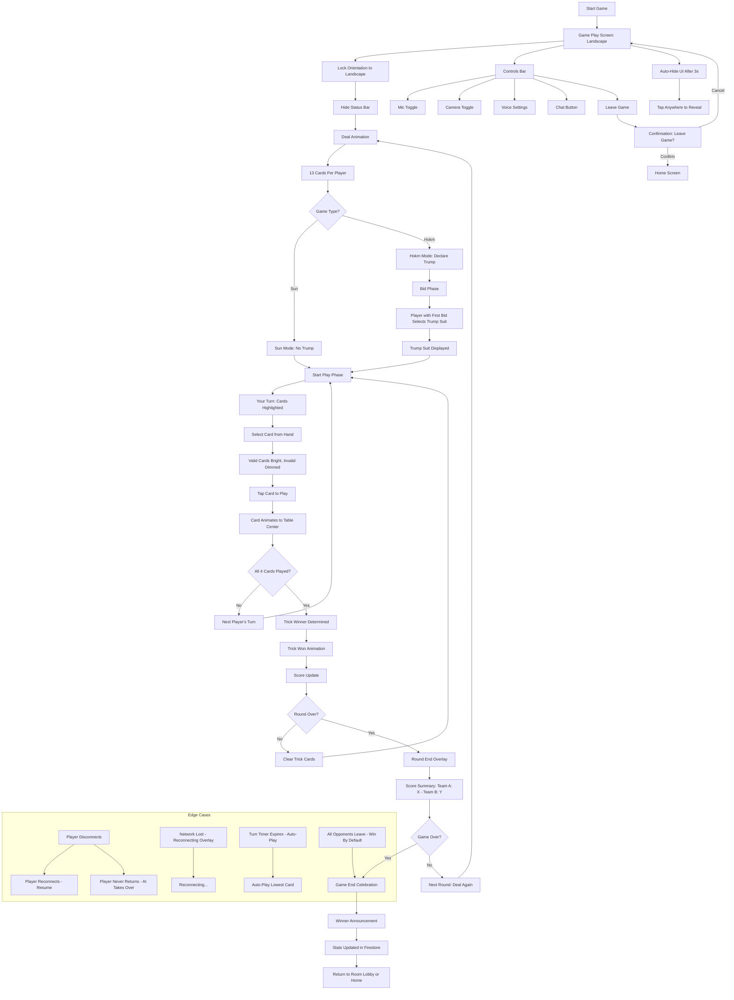
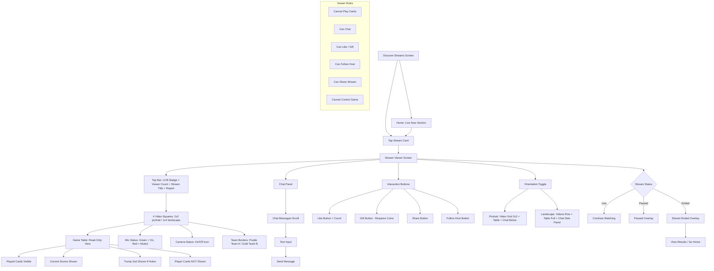
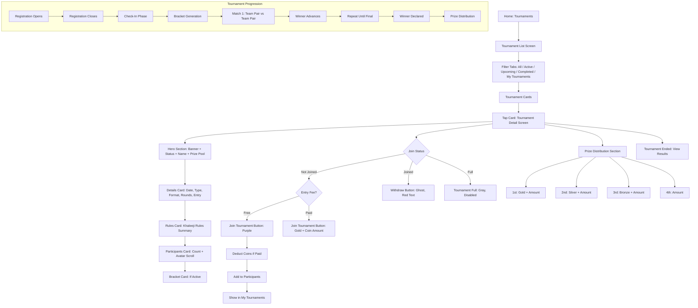
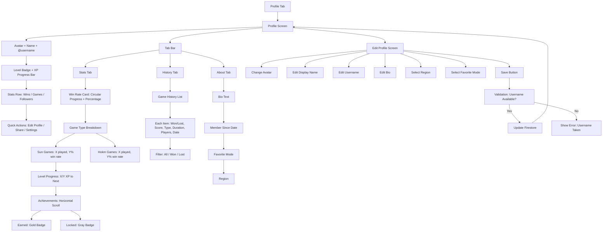
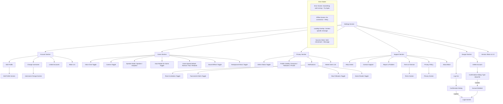

# Bloot — Master Flow Map

> **Purpose:** Mermaid diagrams of ALL screens and transitions in the Bloot app. Every flow, every edge case, every state.

---

## 1. App Launch Flow



---

## 2. Authentication Flow



---

## 3. Home Flow



---

## 4. Room Flow



---

## 5. Game Flow



---

## 6. Stream Viewing Flow



---

## 7. Tournament Flow



---

## 8. Profile Flow



---

## 9. Chat Flow

```mermaid
flowchart TD
    A[Chat Tab] --> B[Chat List Screen]
    B --> C[Filter Tabs: All / Rooms / Direct / Tournaments]
    C --> D[Chat Items]
    D --> E[Tap Conversation]

    E --> F{Conversation Type}
    F -->|Direct| G[DM Screen]
    F -->|Room Invite| H[Room Invitation Modal]

    G --> I[Top Bar: Avatar + Name + Online Status + Call Icons]
    I --> J[Messages: Purple Right / Dark Surface Left]
    J --> K[Your Messages: Aligned End]
    J --> L[Their Messages: Aligned Start]
    L --> M[System Messages: Centered, Muted Text]
    J --> N[Timestamps Between Groups]
    N --> O[Input Area]
    O --> P[Text Input]
    O --> Q[Attachment Icon]
    O --> R[Emoji Icon]
    O --> S[Send Button - Purple, Disabled if Empty]
    O --> T[Quick Action Chips]
    T --> U[Good game! / Nice move! / Let's play again / GG]

    H --> V[Invitation Card]
    V --> W[Host Avatar + Name]
    W --> X[Room Name + Type + Players]
    X --> Y[Join Room Button: Gold]
    X --> Z[Decline Button: Ghost]
    Y --> AA[Join Room Flow]
    Z --> AB[Dismiss, Mark as Read]

    B --> AC[Compose Button]
    AC --> AD[Search Users]
    AD --> AE[Select User]
    AE --> G

    subgraph Edge Cases
        AF[Offline Messages: Queue and Send on Reconnect]
        AG[Image Messages: Thumbnail + Tap to View Full]
        AH[Room Invite Expired: Show "Expired" Badge]
        AI[User Blocked: Hide Messages, Show "Blocked"]
        AJ[Chat Deleted: Remove from List]
    end
```

---

## 10. Settings Flow

