# Bloot — UI-Only Implementation Plan

> **Purpose:** Complete phase-by-phase plan for implementing ALL UI screens, navigation flows, and visual connections as a clickable prototype ready for client review. No backend integration — pure UI/UX with mock data.
> **Scope:** 35 mobile app screens + shared components + navigation graph.
> **Deliverable:** Fully navigable Flutter app with realistic layouts, mock data, and smooth transitions.

---

## 1. UI Decisions Log

| ID | Decision | Rationale |
|----|----------|-----------|
| UI-D001 | All screens built as navigable prototypes | Client needs to click through every flow |
| UI-D002 | Mock data repositories per feature | Realistic content without backend dependency |
| UI-D003 | `go_router` with ShellRoute for bottom nav | Clean navigation, deep-link ready for future |
| UI-D004 | Dark-only theme enforced | MVP scope; all screens use `ThemeManager.darkTheme` |
| UI-D005 | RTL-first layout (`Directionality.rtl`) | Primary market is MENA/Gulf |
| UI-D006 | Bottom nav hidden on game & stream fullscreen | Immersive experience per DESIGN.md |
| UI-D007 | All admin screens deferred to `web_admin/` | Out of mobile app scope |
| UI-D008 | Hero animations on shared elements | Premium feel for stream cards, avatars, profile pics |
| UI-D009 | Skeleton loaders on all async screens | Matches real app loading patterns |
| UI-D010 | Dialogs for confirmations, bottom sheets for filters | Consistent with Material 3 patterns |

---

## 2. Screen Inventory (37 Screens)

### Phase A: Foundation (5 screens)
| # | Screen | File | Route |
|---|--------|------|-------|
| A1 | Splash Screen | `features/onboarding/splash_screen.dart` | `/splash` |
| A2 | Welcome Screen | `features/onboarding/welcome_screen.dart` | `/welcome` |
| A3 | Login Screen | `features/auth/login_screen.dart` | `/login` |
| A4 | OTP Verification | `features/auth/otp_screen.dart` | `/otp` |
| A5 | Complete Profile | `features/auth/complete_profile_screen.dart` | `/complete-profile` |

### Phase B: Home & Discovery (3 screens)
| # | Screen | File | Route |
|---|--------|------|-------|
| B1 | Home Screen | `features/home/home_screen.dart` | `/home` (shell) |
| B2 | Discover Streams | `features/discover/discover_streams_screen.dart` | `/discover` (shell) |
| B3 | Watch Stream | `features/discover/watch_stream_screen.dart` | `/stream/:id` |

### Phase C: Rooms & Game (3 screens)
| # | Screen | File | Route |
|---|--------|------|-------|
| C1 | Create Room | `features/room/create_room_screen.dart` | `/create-room` |
| C2 | Room Lobby | `features/room/room_lobby_screen.dart` | `/room/:id` |
| C3 | Game Play (Landscape) | `features/game/game_play_screen.dart` | `/game/:id` |

### Phase D: Chat & Social (3 screens)
| # | Screen | File | Route |
|---|--------|------|-------|
| E1 | Chat List | `features/chat/chat_list_screen.dart` | `/chat` (shell) |
| E2 | Direct Message | `features/chat/direct_message_screen.dart` | `/chat/:userId` |
| E3 | Room Invitation Modal | `features/chat/room_invitation_screen.dart` | `/room-invite/:id` |

### Phase E: Profile (2 screens)
| # | Screen | File | Route |
|---|--------|------|-------|
| F1 | User Profile | `features/profile/user_profile_screen.dart` | `/profile` (shell) |
| F2 | Edit Profile | `features/profile/edit_profile_screen.dart` | `/edit-profile` |

### Phase F: Settings & Legal (3 screens)
| # | Screen | File | Route |
|---|--------|------|-------|
| G1 | Settings | `features/settings/settings_screen.dart` | `/settings` |
| G2 | Privacy Policy | `features/settings/privacy_policy_screen.dart` | `/privacy` |
| G3 | Terms of Service | `features/settings/terms_screen.dart` | `/terms` |

### Phase G: Edge Cases (4 screens + overlays)
| # | Screen | File | Route |
|---|--------|------|-------|
| H1 | Error State | `features/edge_cases/error_screen.dart` | `/error` |
| H2 | Offline Screen | `features/edge_cases/offline_screen.dart` | `/offline` |
| H3 | Loading Overlay | `core/components/dialogs/loading_dialog.dart` | dialog |
| H4 | Success Overlay | `core/components/dialogs/success_dialog.dart` | dialog |

---

## 3. Navigation Architecture

```mermaid
flowchart TD
    subgraph OnboardingFlow
        SPLASH[Splash] --> WELCOME[Welcome]
        WELCOME --> LOGIN[Login]
    end

    subgraph AuthFlow
        LOGIN --> OTP[OTP]
        OTP --> COMPLETE[Complete Profile]
        COMPLETE --> HOME
    end

    subgraph MainShell[MainShell — Bottom Nav]
        direction TB
        HOME[Home] 
        DISCOVER[Discover]
        PLAY[Play / Create Room]
        CHAT[Chat]
        PROFILE[Profile]
    end

    HOME --> CREATE_ROOM[Create Room]
    HOME --> ROOM_LOBBY[Room Lobby]
    HOME --> WATCH_STREAM[Watch Stream]

    DISCOVER --> WATCH_STREAM
    DISCOVER --> ROOM_LOBBY

    PLAY --> CREATE_ROOM
    PLAY --> ROOM_LOBBY

    CHAT --> DM[Direct Message]
    CHAT --> ROOM_INVITE[Room Invitation]

    PROFILE --> EDIT_PROFILE[Edit Profile]
    PROFILE --> SETTINGS[Settings]
    PROFILE --> USER_PROFILE[Other User Profile]

    ROOM_LOBBY --> GAME_PLAY[Game Play Landscape]
    CREATE_ROOM --> ROOM_LOBBY

    SETTINGS --> PRIVACY[Privacy Policy]
    SETTINGS --> TERMS[Terms of Service]

    HOME -.-> OFFLINE[Offline Screen]
    DISCOVER -.-> OFFLINE
    CHAT -.-> OFFLINE
    PROFILE -.-> OFFLINE

    style MainShell fill:#161622,stroke:#8B5CF6,stroke-width:2px
    style GAME_PLAY fill:#0D2818,stroke:#F59E0B,stroke-width:2px
```



### Route Table

| Route Name | Path | Parent | Notes |
|-----------|------|--------|-------|
| `splash` | `/splash` | root | Initial route if not authenticated |
| `welcome` | `/welcome` | root | Post-splash onboarding |
| `login` | `/login` | root | Phone input |
| `otp` | `/otp` | root | OTP verification |
| `completeProfile` | `/complete-profile` | root | Profile setup |
| `home` | `/home` | `MainShell` | Hero banner + streams |
| `discover` | `/discover` | `MainShell` | Stream discovery |
| `createRoom` | `/create-room` | root | Full-screen form |
| `roomLobby` | `/room/:id` | root | Full-screen lobby |
| `gamePlay` | `/game/:id` | root | Landscape lock |
| `chat` | `/chat` | `MainShell` | Conversation list |
| `directMessage` | `/chat/:userId` | root | DM thread |
| `roomInvitation` | `/room-invite/:id` | root | Invite modal page |
| `profile` | `/profile` | `MainShell` | My profile |
| `editProfile` | `/edit-profile` | root | Edit form |
| `userProfile` | `/user/:userId` | root | Other user's profile |
| `settings` | `/settings` | root | Settings list |
| `privacy` | `/privacy` | root | Legal screen |
| `terms` | `/terms` | root | Legal screen |
| `error` | `/error` | root | Global error fallback |
| `offline` | `/offline` | root | No connection page |

---

## 4. Shared UI Components to Build

### 4.1 Layout Components

| Component | Location | Usage |
|-----------|----------|-------|
| `MainShell` | `features/shell/main_shell.dart` | Bottom nav wrapper for 5 tabs |
| `AppScaffold` | `core/components/app_scaffold.dart` | Consistent scaffold with custom app bar |
| `CustomAppBar` | `core/components/custom_app_bar.dart` | Title, back button, actions |
| `BottomNavBar` | `features/shell/bottom_nav_bar.dart` | 5 items, center play elevated |

### 4.2 Card & Content Components

| Component | Location | Usage |
|-----------|----------|-------|
| `StreamCard` | `features/discover/widgets/stream_card.dart` | Discover + Home stream items |
| `ChatListItem` | `features/chat/widgets/chat_list_item.dart` | Chat conversation rows |
| `MessageBubble` | `features/chat/widgets/message_bubble.dart` | DM purple/dark bubbles |
| `PlayerVideoSquare` | `features/room/widgets/player_video_square.dart` | Lobby + game video seat |
| `GameCardWidget` | `features/game/widgets/game_card_widget.dart` | Playing card visual |
| `QuickActionCard` | `features/home/widgets/quick_action_card.dart` | Home 4-action grid |
| `LiveBadge` | `core/components/live_badge.dart` | Animated LIVE indicator |
| `EmptyStateWidget` | `core/components/empty_state_widget.dart` | No data illustration + CTA |
| `SkeletonCard` | `core/components/skeleton_card.dart` | Loading placeholders |

### 4.3 Input & Control Components

| Component | Location | Usage |
|-----------|----------|-------|
| `PhoneInputField` | `features/auth/widgets/phone_input_field.dart` | Country + phone |
| `OtpInputField` | `features/auth/widgets/otp_input_field.dart` | 4-digit boxes |
| `SearchBar` | `core/components/search_bar.dart` | Discover, chat search |
| `FilterChipRow` | `core/components/filter_chip_row.dart` | Horizontal filter tabs |
| `AvatarPicker` | `features/profile/widgets/avatar_picker.dart` | Profile image selection |

---

## 5. Phase-by-Phase Build Plan

### Phase 0: Shell & Navigation (Day 1)
**Goal:** App boots, navigates, bottom nav works.

- [ ] Define ALL `RouteNames` constants
- [ ] Build `MainShell` with `ShellRoute` and `StatefulNavigationShell`
- [ ] Build custom `BottomNavBar` (5 items, center gold play)
- [ ] Configure `go_router` with all routes
- [ ] Create placeholder screens for every route (scaffold + title + back)
- [ ] Implement auth redirect logic (splash → welcome → login → home)
- [ ] Add mock auth state (toggle login/logout for testing)

**QA:** Tap every bottom nav item → screen changes. Deep link to `/room/123` → lobby opens. Back gesture works.

---

### Phase 1: Onboarding & Auth (Day 1–2)
**Goal:** Login flow is fully visual and clickable.

- [ ] **Splash Screen:** Logo, floating suits animation, progress bar, auto-navigate after 2.5s
- [ ] **Welcome Screen:** Headline, 3 feature cards, pagination dots, Get Started CTA, Sign In link
- [ ] **Login Screen:** Country code selector (+966 default), phone input, Send Code button, terms checkbox
- [ ] **OTP Screen:** 4-digit input, auto-focus, resend timer (30s), error shake animation
- [ ] **Complete Profile:** Avatar picker, display name, username with availability check (mock), Terms accept
- [ ] **Mock Auth Cubit:** `initial → loading → otpSent → authenticated → error` states

**QA:** Complete flow: Splash → Welcome → Login → OTP → Complete Profile → Home. Username shows "Taken" mock.

---

### Phase 2: Home & Discovery (Day 2–3)
**Goal:** Home feels alive with realistic mock content.

- [ ] **Home Screen:**
  - Top bar: avatar, name+level, coins, notification bell
  - Hero banner: "Baloot Live" with gradient, CTA
  - Quick Actions: 3 cards (Play, Voice, Live) with navigation
  - Live Now: vertical list of `StreamCard`s with LIVE badge, viewer count
  - Empty state when no streams
  - Pull-to-refresh skeleton
- [ ] **Discover Streams:**
  - Search bar
  - Filter tabs: Popular, New, Top Rated, Voice Only, Following
  - Advanced filter bottom sheet
  - 2-column stream card grid
  - Infinite scroll pagination (mock)
- [ ] **Watch Stream:**
  - 2×2 video grid (portrait) / row (landscape)
  - Read-only game table overlay
  - LIVE badge + viewer count + stream title top bar
  - Chat panel with messages + input
  - Like, Gift, Share, Follow buttons
  - Stream ended overlay

**QA:** Tap stream card → Watch Stream. Rotate → landscape layout. Send chat message → appears in list.

---

### Phase 3: Rooms & Game (Day 3–4)
**Goal:** Room creation to game play is navigable.

- [ ] **Create Room:**
  - Room name input
  - Room type cards: Private, Public, Live Stream
  - Voice/Camera/Spectator toggles
  - Advanced settings accordion (min level, speed, password)
  - Live preview card
  - Create button → navigates to Room Lobby
- [ ] **Room Lobby:**
  - 4-player seat grid (2×2)
  - Player video squares with mic/camera/ready status
  - Empty seat states: pulsing border, "Waiting...", invite button
  - Team colors: Team A purple border, Team B gold border
  - Room code display with copy/share
  - Ready/Not Ready toggle
  - Start Game button (disabled until 4 ready, creator only)
  - Chat drawer (slide from bottom)
  - Kick player menu (creator only)
- [ ] **Game Play (Landscape):**
  - Orientation lock to landscape
  - Hide status bar, hide bottom nav
  - 4 video squares around table
  - Green felt game table in center
  - 13-card hand fanned at bottom
  - Card selection: tap to raise, valid cards bright, invalid dimmed
  - Trump suit display (Hokm mode)
  - Trick play animation (card flies to center)
  - Score display: "Us: X — Them: Y"
  - Round end overlay with summary
  - Game end celebration overlay
  - Auto-hide controls (3s), tap to reveal
  - Mic/camera/chat/leave controls
  - Turn indicator (glowing border on active player)

**QA:** Create Room → Lobby. Toggle Ready → badge changes. Tap Start Game → landscape game. Tap card → raises. Leave → confirmation → home.

---

### Phase 4: Chat & Profile (Day 4–5)
**Goal:** Social features fully visual.

- [ ] **Chat List:**
  - Filter tabs: All, Rooms, Direct
  - Conversation rows: avatar, name, last message, unread badge, timestamp
  - Compose button → search users
  - Tap → Direct Message
- [ ] **Direct Message:**
  - Top bar: avatar, name, online status
  - Message bubbles: purple (me) / dark surface (them)
  - System messages centered
  - Timestamps between groups
  - Text input + send button + attachment + emoji
  - Quick action chips: "Good game!", "Nice move!", "Let's play again"
- [ ] **Room Invitation:**
  - Invitation card with host info, room details
  - Join Room (gold) / Decline (ghost) buttons
- [ ] **User Profile:**
  - Avatar + name + @username + level badge + XP bar
  - Stats row: Wins / Games / Followers
  - Tab bar: Stats, History, About
  - Stats tab: Win rate circle, Sun/Hokm breakdown, achievements scroll
  - History tab: game result list with won/lost, scores, players
  - About tab: bio, member since, favorite mode, region
  - Quick actions: Edit Profile, Share, Settings
- [ ] **Edit Profile:**
  - Change avatar, display name, username, bio
  - Region selector dropdown
  - Favorite mode selector
  - Save button with validation

**QA:** Chat → DM → send message → appears. Profile → Edit → save → back to profile. Scroll achievements.

---

### Phase 5: Settings & Edge Cases (Day 5)
**Goal:** All auxiliary screens polish the experience.

- [ ] **Settings Screen:**
  - Account: Edit Profile, Change Username, Linked Accounts, Block List
  - Game: Voice, Camera, Speaker Mode, Auto-Rotate, Game Speed, Sound FX, BGM
  - Privacy: Online Status, Profile Visibility, Notification toggles, Muted Users
  - Support: Help, Contact, Report, Terms, Privacy, About
  - Danger: Log Out, Delete Account
- [ ] **Privacy Policy & Terms:** Scrollable legal text, last updated date
- [ ] **Error Screen:** Illustration, "Something went wrong", Try Again CTA
- [ ] **Offline Screen:** Illustration, "No connection", Retry CTA
- [ ] **Loading Overlay:** Contextual message + spinner
- [ ] **Success Overlay:** Gold checkmark animation + message
- [ ] **Confirmation Dialogs:** Leave room, log out, delete account

**QA:** Settings → every toggle tappable (mock state). Trigger error → Error screen. Disconnect → Offline banner + screen.

---

## 6. Mock Data Strategy

Each feature gets a `*_mock_data.dart` file with static lists and a `Mock*Repository` class.

```dart
// Example: features/discover/data/stream_mock_data.dart
class MockStreamRepository {
  static final List<StreamModel> streams = [
    StreamModel(
      id: 'stream_1',
      title: 'Ahmed & Khalid vs Faisal Band',
      hostName: 'Ahmed',
      hostAvatar: 'https://i.pravatar.cc/150?img=11',
      viewerCount: 1240,
      isLive: true,
      roomType: RoomType.baloot,
      playerCount: 4,
      thumbnailUrl: 'https://picsum.photos/seed/bloot1/400/225',
    ),
    // ... 10+ items
  ];
}
```

**Mock data needed for:**
- Streams (8–10 items)
- Chat conversations (5 items)
- DM messages (20 items)
- Profile stats + game history (10 items)
- Room lobby players (4 seats, various states)
- Game cards (52 deck, 13 hand)

---

## 7. Animation & Motion Spec

| Animation | Duration | Curve | Implementation |
|-----------|----------|-------|----------------|
| Page transition | 250ms | `easeInOut` | `go_router` default + custom |
| Splash logo fade-in | 600ms | `easeOut` | `AnimatedOpacity` |
| Splash auto-navigate | 2500ms | — | `Future.delayed` |
| Card tap (raise) | 150ms | `easeOutBack` | `Transform.translate` |
| LIVE badge pulse | 1500ms | `easeInOut` | `AnimationController` loop |
| Skeleton shimmer | 1200ms | `linear` | `Shimmer` package or custom |
| Bottom nav item switch | 200ms | `easeInOut` | `AnimatedContainer` |
| Chat message appear | 200ms | `easeOut` | `AnimatedList` or `SlideTransition` |
| Game overlay fade | 300ms | `easeInOut` | `AnimatedOpacity` |
| Success checkmark | 400ms | `easeOutBack` | `ScaleTransition` + `Icon` |
| Pull-to-refresh | 250ms | `easeOut` | `RefreshIndicator` |

---

## 8. RTL Compliance Checklist

Every screen MUST pass these checks:

- [ ] `Directionality` set to `rtl` for all screens
- [ ] `EdgeInsetsDirectional` used instead of `EdgeInsets`
- [ ] `AlignmentDirectional` used instead of `Alignment`
- [ ] `Row` children reverse correctly in RTL
- [ ] `ListView` scrolls right-to-left where appropriate
- [ ] Text aligns `start` not `left`
- [ ] Back button arrow points right in RTL
- [ ] Bottom nav icons flip order in RTL
- [ ] Game player positions: You at bottom, partner at top, opponents left/right (flipped)
- [ ] Chat bubbles: Me on left, Them on right in RTL

---

## 9. Client Review Deliverable Checklist

Before sending to client, verify:

- [ ] **Navigation:** Every screen reachable from at least one other screen
- [ ] **Bottom Nav:** 5 tabs switch smoothly, Play button visually prominent
- [ ] **Mock Data:** No empty lists, no "lorem ipsum", realistic Arabic names
- [ ] **Dark Theme:** `#0A0A0F` background on every screen, no light leaks
- [ ] **Purple/Gold:** Primary actions purple, wins/achievements/coins gold
- [ ] **Typography:** Cairo font, readable sizes, no overflows on small screens
- [ ] **LIVE Badge:** Red, pulsing, visible on every stream-related screen
- [ ] **Loading States:** Skeletons on Home, Discover, Chat
- [ ] **Empty States:** Custom illustration + message + CTA on all list screens
- [ ] **Error States:** Network error triggers offline banner + retry
- [ ] **Responsive:** No overflow on iPhone SE (375w) or Pixel 8 (412w)
- [ ] **Landscape:** Game play and stream viewer adapt correctly
- [ ] **Accessibility:** All interactive elements have semantic labels
- [ ] **No Debug:** `debugShowCheckedModeBanner: false`, no print statements

---

## 10. File Structure (Target)

```
lib/
├── app/
│   ├── app.dart
│   └── app_initializer.dart
├── config/
│   └── routes/
│       ├── app_router.dart      ← All routes + shell
│       ├── app_redirect.dart
│       ├── extra_codec.dart
│       └── routes.dart          ← RouteNames constants
├── core/
│   ├── components/
│   │   ├── app_button.dart
│   │   ├── app_scaffold.dart    ← NEW
│   │   ├── app_text.dart
│   │   ├── custom_app_bar.dart  ← NEW
│   │   ├── empty_state_widget.dart  ← NEW
│   │   ├── live_badge.dart      ← NEW
│   │   ├── search_bar.dart      ← NEW
│   │   └── skeleton_card.dart   ← NEW
│   └── ... (existing)
├── features/
│   ├── onboarding/
│   │   ├── splash_screen.dart
│   │   └── welcome_screen.dart
│   ├── auth/
│   │   ├── login_screen.dart
│   │   ├── otp_screen.dart
│   │   ├── complete_profile_screen.dart
│   │   └── widgets/
│   │       ├── phone_input_field.dart
│   │       └── otp_input_field.dart
│   ├── shell/
│   │   ├── main_shell.dart      ← Bottom nav shell
│   │   └── bottom_nav_bar.dart
│   ├── home/
│   │   ├── home_screen.dart
│   │   └── widgets/
│   │       ├── hero_banner.dart
│   │       ├── quick_action_card.dart
│   │       └── stream_card.dart
│   ├── discover/
│   │   ├── discover_streams_screen.dart
│   │   ├── watch_stream_screen.dart
│   │   └── widgets/
│   │       ├── stream_card.dart
│   │       └── filter_bottom_sheet.dart
│   ├── room/
│   │   ├── create_room_screen.dart
│   │   ├── room_lobby_screen.dart
│   │   └── widgets/
│   │       ├── player_video_square.dart
│   │       ├── room_chat_drawer.dart
│   │       └── seat_widget.dart
│   ├── game/
│   │   ├── game_play_screen.dart
│   │   └── widgets/
│   │       ├── game_card_widget.dart
│   │       ├── game_table.dart
│   │       ├── trick_area.dart
│   │       └── score_display.dart
│   ├── chat/
│   │   ├── chat_list_screen.dart
│   │   ├── direct_message_screen.dart
│   │   ├── room_invitation_screen.dart
│   │   └── widgets/
│   │       ├── chat_list_item.dart
│   │       └── message_bubble.dart
│   ├── profile/
│   │   ├── user_profile_screen.dart
│   │   ├── edit_profile_screen.dart
│   │   └── widgets/
│   │       ├── avatar_picker.dart
│   │       ├── stat_card.dart
│   │       └── history_item.dart
│   ├── settings/
│   │   ├── settings_screen.dart
│   │   ├── privacy_policy_screen.dart
│   │   └── terms_screen.dart
│   └── edge_cases/
│       ├── error_screen.dart
│       └── offline_screen.dart
└── main.dart
```

---

## 11. Post-UI-Prototype Roadmap

| Priority | Task | Notes |
|----------|------|-------|
| P1 | Firebase Auth integration | Replace mock auth with phone OTP |
| P1 | Firestore data layer | Replace mock repositories |
| P1 | Agora video/voice | Integrate SDK into video squares |
| P2 | Baloot game engine | Cloud Functions for rules |
| P2 | Push notifications | FCM setup |
| P2 | Image upload | Firebase Storage for avatars |
| P3 | Light theme | ThemeManager already supports it |
| P3 | Social auth | Apple + Google Sign In |
| P3 | Deep links | Firebase Dynamic Links for invites |

---

> **End of Plan.** This document is the single source of truth for the UI prototype build. All screen implementations must reference this plan, the DESIGN.md tokens, and the master_flow_map.md for navigation behavior.
