# Bloot — Master Flow Map

Complete Mermaid diagram showing ALL screens and transitions for the Bloot app.

## Design System Context

| Token | Value |
|---|---|
| Primary | Purple `#8B5CF6` |
| Accent | Gold `#F59E0B` |
| Direction | RTL (Arabic) |
| Theme | Dark |
| Platform | Flutter / Firebase |

---

## Legend — Node Classes

| Class | Colour | Flow |
|---|---|---|
| `launch` | `#6D28D9` | App Launch |
| `auth` | `#7C3AED` | Authentication |
| `home` | `#8B5CF6` | Home / Discovery |
| `room` | `#F59E0B` | Room / Game |
| `stream` | `#EC4899` | Streaming |
| `tournament` | `#10B981` | Tournaments |
| `chat` | `#3B82F6` | Chat / Messages |
| `profile` | `#8B5CF6` | Profile |
| `settings` | `#6B7280` | Settings |
| `error` | `#EF4444` | Error / Edge-case |

---

## Complete Application Flow

```mermaid
graph TD
    %% ── APP LAUNCH ──────────────────────────────────────────────
    SPLASH[Splash Screen]:::launch
    WELCOME[Welcome Onboarding]:::launch
    MAINTENANCE[Maintenance Screen]:::error
    FORCE_UPDATE[Force Update Screen]:::error

    SPLASH -->|app version ok| WELCOME
    SPLASH -->|version outdated| FORCE_UPDATE
    SPLASH -->|server maintenance| MAINTENANCE
    WELCOME -->|new user| AUTH_PHONE
    WELCOME -->|returning user| HOME

    %% ── AUTHENTICATION ──────────────────────────────────────────
    AUTH_PHONE[Phone Number Entry]:::auth
    AUTH_OTP[OTP Verification]:::auth
    AUTH_OTP_RESEND[Resend OTP]:::auth
    PROFILE_SETUP[Profile Setup — Avatar & Nickname]:::auth
    PROFILE_TOS[Terms of Service Consent]:::auth
    AUTH_ERROR[Auth Error Screen]:::error

    AUTH_PHONE -->|valid phone| AUTH_OTP
    AUTH_PHONE -->|invalid phone| AUTH_PHONE
    AUTH_OTP -->|correct OTP| PROFILE_SETUP
    AUTH_OTP -->|wrong OTP| AUTH_OTP
    AUTH_OTP -->|resend| AUTH_OTP_RESEND
    AUTH_OTP_RESEND -->|otp sent| AUTH_OTP
    AUTH_OTP -->|server error| AUTH_ERROR
    PROFILE_SETUP -->|save profile| PROFILE_TOS
    PROFILE_TOS -->|accept terms| HOME
    PROFILE_TOS -->|decline| WELCOME

    %% ── HOME ────────────────────────────────────────────────────
    HOME[Home Screen]:::home
    HOME_HERO[Hero Banner — Featured Stream / Tournament]:::home
    HOME_QUICK[Quick Actions — Create / Join Room]:::home
    HOME_LIVE[Live Streams Carousel]:::home
    HOME_TOURNAMENTS[Active Tournaments]:::home
    HOME_FRIENDS[Online Friends Bar]:::home

    HOME --> HOME_HERO
    HOME --> HOME_QUICK
    HOME --> HOME_LIVE
    HOME --> HOME_TOURNAMENTS
    HOME --> HOME_FRIENDS
    HOME_HERO -->|tap stream| STREAM_WATCH
    HOME_HERO -->|tap tournament| TOURNAMENT_DETAIL
    HOME_QUICK -->|create| ROOM_CREATE
    HOME_QUICK -->|join| ROOM_JOIN
    HOME_LIVE -->|tap stream| STREAM_WATCH
    HOME_TOURNAMENTS -->|tap| TOURNAMENT_DETAIL
    HOME_FRIENDS -->|tap friend| PROFILE_VIEW

    %% ── ROOM FLOW ───────────────────────────────────────────────
    ROOM_CREATE[Create Room]:::room
    ROOM_JOIN[Join Room — Code Entry]:::room
    ROOM_JOIN_CODE[Room Code Input]:::room
    ROOM_LOBBY[Room Lobby — 4 Players]:::room
    ROOM_LOBBY_READY[Ready State Toggle]:::room
    ROOM_LOBBY_CHAT[Pre-game Chat]:::room
    GAME_PLAY[Game Play Screen]:::room
    GAME_BID[Bidding Phase]:::room
    GAME_TRICK[Trick Play Phase]:::room
    GAME_SCORE_ROUND[Round Score Summary]:::room
    GAME_SCORE_FINAL[Final Score — Game Results]:::room
    ROOM_INVITE[Room Invitation Modal]:::room
    ROOM_FULL[Room Full Toast]:::error
    ROOM_DISCONNECTED[Disconnect Overlay]:::error

    HOME -->|create room| ROOM_CREATE
    HOME -->|join room| ROOM_JOIN
    ROOM_CREATE -->|set rules & invite| ROOM_LOBBY
    ROOM_JOIN -->|enter code| ROOM_JOIN_CODE
    ROOM_JOIN_CODE -->|valid code| ROOM_LOBBY
    ROOM_JOIN_CODE -->|invalid code| ROOM_JOIN
    ROOM_JOIN_CODE -->|room full| ROOM_FULL
    ROOM_LOBBY --> ROOM_LOBBY_READY
    ROOM_LOBBY --> ROOM_LOBBY_CHAT
    ROOM_LOBBY -->|invite friend| ROOM_INVITE
    ROOM_INVITE -->|friend accepts| ROOM_LOBBY
    ROOM_LOBBY_READY -->|all 4 ready| GAME_PLAY
    GAME_PLAY --> GAME_BID
    GAME_BID --> GAME_TRICK
    GAME_TRICK --> GAME_SCORE_ROUND
    GAME_SCORE_ROUND -->|next round| GAME_BID
    GAME_SCORE_ROUND -->|game over| GAME_SCORE_FINAL
    GAME_SCORE_FINAL --> HOME
    ROOM_LOBBY -->|player disconnects| ROOM_DISCONNECTED
    GAME_PLAY -->|player disconnects| ROOM_DISCONNECTED
    ROOM_DISCONNECTED -->|reconnect| GAME_PLAY
    ROOM_DISCONNECTED -->|timeout| GAME_SCORE_ROUND

    %% ── STREAM VIEWING FLOW ─────────────────────────────────────
    DISCOVER[Discover — Browse Streams]:::stream
    STREAM_WATCH[Stream Viewer]:::stream
    STREAM_CHAT[Stream Chat Panel]:::stream
    STREAM_GIFT[Gift / Like Overlay]:::stream
    STREAM_HOST[Host Controls]:::stream
    STREAM_END[Stream Ended Screen]:::stream
    STREAM_OFFLINE[Stream Offline / Not Found]:::error

    HOME -->|discover tab| DISCOVER
    DISCOVER -->|tap stream| STREAM_WATCH
    STREAM_WATCH --> STREAM_CHAT
    STREAM_WATCH --> STREAM_GIFT
    STREAM_WATCH -->|host view| STREAM_HOST
    STREAM_HOST -->|end stream| STREAM_END
    STREAM_WATCH -->|stream ended| STREAM_END
    STREAM_WATCH -->|invalid / offline| STREAM_OFFLINE
    STREAM_END -->|follow host| PROFILE_VIEW
    STREAM_END --> HOME

    %% ── TOURNAMENT FLOW ──────────────────────────────────────────
    TOURNAMENT_LIST[Tournament List]:::tournament
    TOURNAMENT_DETAIL[Tournament Detail]:::tournament
    TOURNAMENT_REGISTER[Registration Modal]:::tournament
    TOURNAMENT_BRACKET[Bracket View]:::tournament
    TOURNAMENT_MATCH[Tournament Match — Enter Room]:::tournament
    TOURNAMENT_RESULTS[Tournament Results]:::tournament
    TOURNAMENT_FULL[Tournament Full Toast]:::error
    TOURNAMENT_EXPIRED[Registration Closed]:::error

    HOME -->|tournaments tab| TOURNAMENT_LIST
    TOURNAMENT_LIST -->|tap| TOURNAMENT_DETAIL
    TOURNAMENT_DETAIL -->|register| TOURNAMENT_REGISTER
    TOURNAMENT_REGISTER -->|success| TOURNAMENT_BRACKET
    TOURNAMENT_REGISTER -->|full| TOURNAMENT_FULL
    TOURNAMENT_REGISTER -->|closed| TOURNAMENT_EXPIRED
    TOURNAMENT_DETAIL -->|view bracket| TOURNAMENT_BRACKET
    TOURNAMENT_BRACKET -->|match ready| TOURNAMENT_MATCH
    TOURNAMENT_MATCH -->|enter room| ROOM_LOBBY
    ROOM_LOBBY -->|all ready| GAME_PLAY
    GAME_SCORE_FINAL -->|tournament match| TOURNAMENT_BRACKET
    TOURNAMENT_BRACKET -->|eliminated / champion| TOURNAMENT_RESULTS
    TOURNAMENT_RESULTS --> HOME

    %% ── CHAT FLOW ───────────────────────────────────────────────
    MESSAGES[Messages List]:::chat
    CONVERSATION[Chat Conversation]:::chat
    DM_COMPOSE[New Message Compose]:::chat
    ROOM_INVITE_MODAL[Room Invite via Chat]:::chat
    NOTIFICATIONS[Bell — Notifications]:::chat

    HOME -->|messages tab| MESSAGES
    MESSAGES -->|tap conversation| CONVERSATION
    MESSAGES -->|compose| DM_COMPOSE
    CONVERSATION -->|invite to room| ROOM_INVITE_MODAL
    HOME -->|bell icon| NOTIFICATIONS
    NOTIFICATIONS -->|room invite| ROOM_INVITE_MODAL
    NOTIFICATIONS -->|match starting| GAME_PLAY
    NOTIFICATIONS -->|tournament alert| TOURNAMENT_DETAIL
    NOTIFICATIONS -->|stream live| STREAM_WATCH
    ROOM_INVITE_MODAL -->|accept| ROOM_LOBBY
    ROOM_INVITE_MODAL -->|decline| MESSAGES

    %% ── PROFILE FLOW ────────────────────────────────────────────
    PROFILE_VIEW[Profile View]:::profile
    PROFILE_EDIT[Edit Profile]:::profile
    PROFILE_STATS[Player Statistics]:::profile
    PROFILE_ACHIEVEMENTS[Achievements / Badges]:::profile
    PROFILE_HISTORY[Game History]:::profile
    PROFILE_FOLLOWERS[Followers / Following]:::profile

    HOME -->|profile tab| PROFILE_VIEW
    STREAM_END -->|follow host| PROFILE_VIEW
    PROFILE_VIEW -->|edit| PROFILE_EDIT
    PROFILE_VIEW -->|stats tab| PROFILE_STATS
    PROFILE_VIEW -->|achievements tab| PROFILE_ACHIEVEMENTS
    PROFILE_VIEW -->|history tab| PROFILE_HISTORY
    PROFILE_VIEW -->|followers tab| PROFILE_FOLLOWERS
    PROFILE_EDIT -->|save| PROFILE_VIEW
    PROFILE_STATS --> HOME
    PROFILE_ACHIEVEMENTS --> HOME

    %% ── SETTINGS FLOW ───────────────────────────────────────────
    SETTINGS[Settings]:::settings
    SETTINGS_LANGUAGE[Language — Arabic / English]:::settings
    SETTINGS_NOTIFICATIONS[Notification Preferences]:::settings
    SETTINGS_PRIVACY[Privacy & Blocking]:::settings
    SETTINGS_AUDIO[Audio & Mic Settings]:::settings
    SETTINGS_ACCOUNT[Account — Delete / Logout]:::settings
    SETTINGS_ABOUT[About Bloot]:::settings

    HOME -->|settings gear| SETTINGS
    SETTINGS --> SETTINGS_LANGUAGE
    SETTINGS --> SETTINGS_NOTIFICATIONS
    SETTINGS --> SETTINGS_PRIVACY
    SETTINGS --> SETTINGS_AUDIO
    SETTINGS --> SETTINGS_ACCOUNT
    SETTINGS --> SETTINGS_ABOUT
    SETTINGS_ACCOUNT -->|logout| WELCOME
    SETTINGS_ACCOUNT -->|delete account| AUTH_PHONE

    %% ── ERROR / EDGE CASES ──────────────────────────────────────
    ERROR_GENERAL[Generic Error Screen]:::error
    ERROR_NETWORK[Offline / No Connection]:::error
    ERROR_SERVER[Server Error — 5xx]:::error
    LOADING[Loading / Skeleton Screen]:::error

    AUTH_PHONE -->|network fail| ERROR_NETWORK
    ROOM_LOBBY -->|network fail| ERROR_NETWORK
    GAME_PLAY -->|network fail| ERROR_NETWORK
    STREAM_WATCH -->|network fail| ERROR_NETWORK
    TOURNAMENT_REGISTER -->|server error| ERROR_SERVER
    ERROR_NETWORK -->|retry| HOME
    ERROR_SERVER -->|retry| HOME
    ERROR_GENERAL --> HOME
    LOADING -->|data loaded| CURRENT_SCREEN

    %% ── CLASS DEFINITIONS ───────────────────────────────────────
    classDef launch fill:#6D28D9,stroke:#4C1D95,color:#fff
    classDef auth fill:#7C3AED,stroke:#5B21B6,color:#fff
    classDef home fill:#8B5CF6,stroke:#6D28D9,color:#fff
    classDef room fill:#F59E0B,stroke:#D97706,color:#000
    classDef stream fill:#EC4899,stroke:#DB2777,color:#fff
    classDef tournament fill:#10B981,stroke:#059669,color:#fff
    classDef chat fill:#3B82F6,stroke:#2563EB,color:#fff
    classDef profile fill:#8B5CF6,stroke:#6D28D9,color:#fff
    classDef settings fill:#6B7280,stroke:#4B5563,color:#fff
    classDef error fill:#EF4444,stroke:#DC2626,color:#fff
```

---

## Screen Count by Flow

| Flow | Screens |
|---|---:|
| App Launch | 4 |
| Authentication | 6 |
| Home | 6 |
| Room / Game | 14 |
| Stream Viewing | 7 |
| Tournament | 8 |
| Chat | 5 |
| Profile | 6 |
| Settings | 7 |
| Error / Edge | 4 |
| **Total** | **67** |

---

## Transition Summary

| From → To | Trigger | Notes |
|---|---|---|
| Splash → Welcome | Version OK | Onboarding shown once per install |
| Splash → Force Update | Outdated | Mandatory upgrade flow |
| Welcome → Auth Phone | New user | Firebase Auth phone provider |
| Auth OTP → Profile Setup | Verified | Firestore user doc created |
| Home → Create Room | Tap CTA | Room doc in Firestore |
| Room Lobby → Game Play | All 4 ready | Realtime DB ready-state listener |
| Game Score Round → Game Bid | Next round | Baloot standard 13-round cycle |
| Discover → Stream Watch | Tap card | Agora token fetched on entry |
| Tournament Register → Bracket | Registered | Firestore tournament doc updated |
| Messages → Room Invite | Tap invite | Deep link / FCFM notification |
| Profile → Edit | Tap edit | Image picker + Firestore update |
| Any → Error Network | Connectivity loss | Retry with exponential backoff |